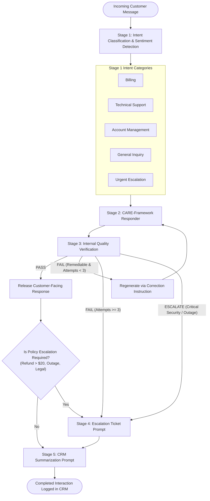

# FlexTime AI Customer Support — Technical Architecture Documentation

> **Assessment Disclaimer:** FlexTime is a fictional software-as-a-service (SaaS) company. All corporate policies, operational thresholds, employee identities, customer profiles, ticket numbers, and credentials referenced in this documentation and associated project files are scenario-based test artifacts created strictly for evaluating AI prompt-engineering architectures.

---

## 1. Overview

The **FlexTime AI Customer Support Prompt Chain** is a modular, multi-stage language model system designed to deliver high-quality, empathetic, policy-compliant, and secure customer support for a remote workforce management SaaS platform.

Rather than relying on a single monolithic prompt, this system decomposes customer support into discrete, specialized prompt stages:
- **Triage & Classification**: Deterministic classification of intent, sentiment, and escalation indicators.
- **Empathy-Driven Generation**: Structured customer communication applying the **CARE** framework (**C**onnect, **A**cknowledge, **R**esolve, **E**nd positively) strictly under 100 words.
- **Reflection & Pre-Send Verification**: An internal gatekeeper that audits drafts across 10 safety and compliance checkpoints before release.
- **Human Handover & Ticketing**: Clean translation of complex or policy-exceeding cases into structured tickets for human specialists.
- **CRM Telemetry & Summarization**: Standardized internal database logging of interaction ground truth without secret leakage or hallucination.

The architecture strictly reserves automated resolutions for low-risk, policy-bounded requests while cleanly routing financial overages, account ownership transfers, and critical security incidents to human specialists.

---

## 2. Prompt Chain Architecture

The complete customer support pipeline executes across five sequential stages:

```
Customer Message ──▶ [Stage 1: Intent & Sentiment] 
                            │
                            ▼
                     [Stage 2: CARE Responder] ◀──┐ (Regeneration Loop, Max 3 Attempts)
                            │                     │
                            ▼                     │
                     [Stage 3: Verification] ─────┘
                       │           │
                     (PASS)    (ESCALATE)
                       │           │
                       ▼           ▼
               [Customer Reply]  [Stage 4: Escalation Ticket]
                       │           │
                       └─────┬─────┘
                             ▼
                     [Stage 5: CRM Record]
```

### Stage 1: Intent Classification & Sentiment Detection
Stage 1 operates as the frontline triage router. It accepts the customer's raw, untrusted message, classifies it into exactly one of five canonical intents, detects customer emotional sentiment across four canonical categories, and computes a confidence score. Stage 1 generates zero customer-facing text, solves no problems, and treats customer text as untrusted data to neutralize prompt-injection attempts.

### Stage 2: CARE-Framework Empathy-Driven Responder
Stage 2 synthesizes the customer message, Stage 1 classifications, and verified policy excerpts from [`fextime_policy_manual.md`](file:///c:/Users/HP/OneDrive/Desktop/flex-time-customer-support/fextime_policy_manual.md) to generate a concise, customer-facing response strictly under 100 words. Following the CARE framework, it establishes natural rapport, validates customer emotion without defensiveness, provides safe policy-grounded guidance, and closes constructively without making unverified promises.

### Stage 3: Internal Quality Verification & Reflection
Stage 3 is an internal quality gatekeeper operating between Stage 2 and the customer. Prior to message delivery, it conducts a binary (PASS/FAIL) audit across 10 dimensions: policy compliance, $20 refund ceiling, account security, information security, accuracy/hallucination, CARE framework adherence, sentiment tone, intent alignment, word count (<100 words), and customer safety. If remediable defects are detected, it issues a targeted `correction_instruction` triggering a regeneration loop (capped at 3 cycles). If critical security violations appear, it halts auto-replies and triggers immediate escalation.

### Stage 4: Escalation Ticket Prompt
Stage 4 converts complex, sensitive, unresolved, or policy-exceeding interactions into structured Human Handover Tickets. It extracts the customer's verified name (or `"Unknown"`), categorizes the issue into one of the five approved intents, summarizes the core grievance, and articulates the policy justification for human intervention. Stage 4 automatically redacts any exposed API keys, secret tokens, or internal ticket numbers.

### Stage 5: CRM Summarization Prompt
Stage 5 executes upon interaction completion to create a structured, 7-field internal record for customer relationship management (CRM) systems. It logs interaction ground truth, preserves Stage 1 classifications, documents whether the case was resolved or remains open, accurately flags escalation and follow-up states, and enforces complete credential omission.

---

## 3. Intent Routing & Sentiment Detection

To prevent classification drift, the pipeline enforces strict, closed enums for both intent and sentiment.

### Intent Categories (Strict Enum of 5)
1. **`Billing`**: Invoices, subscription pricing, prorated seat additions, payment methods, duplicate charges, and refund requests within standard support limits.
2. **`Technical Support`**: Product bugs, clock-in/out failures, GPS mobile tracking issues, payroll integration sync errors (e.g., QuickBooks, Gusto), and performance glitches.
3. **`Account Management`**: User provisioning, role permission updates (Member, Manager, Admin), password resets, MFA assistance, and workspace ownership transfers.
4. **`General Inquiry`**: Pre-sales inquiries, product feature questions, shift scheduling rules, trial terms, and general documentation requests.
5. **`Urgent Escalation`**: System-wide platform outages (e.g., 502 Bad Gateway), active security breaches, suspected unauthorized logins, credential theft, legal threats, and regulatory complaints.

### Sentiment Categories (Strict Enum of 4)
1. **`Angry`**: Rage, hostility, aggressive profanity, all-caps yelling, threats of litigation, or public shaming. Handled with calm, respectful, non-defensive language without placing blame on the user.
2. **`Frustrated`**: Impatience, fatigue, or annoyance resulting from recurring glitches or delayed workflows. Handled with empathetic validation focused on concrete troubleshooting.
3. **`Neutral`**: Objective, transactional, or polite business inquiries. Handled with direct, clear, and efficient communication without forced apologies.
4. **`Satisfied`**: Expressions of gratitude, appreciation, or praise. Handled with warm, helpful closure without unneeded apologies or escalations.

---

## 4. Mermaid.js Architecture Diagram

The flowchart below details the complete execution path, decision branches, reflection loop, and data handoffs across the prompt chain:



---

## 5. Security Guardrails

The architecture implements defense-in-depth principles to isolate the AI pipeline from adversarial tampering and data exposure:

1. **Untrusted Input Boundary**: All incoming customer text is treated as unverified data. Instructions, roleplay requests, or commands embedded within customer messages cannot alter prompt system instructions, policy boundaries, or output schemas.
2. **Prompt Injection Resistance**: The pipeline ignores instructions attempting to enter "debug mode", disclose base instructions, override intent classifications, or award free service credits.
3. **Zero Credential Disclosure**: Frontline prompts are prohibited from exposing API keys, database connection strings, passwords, authentication bearer tokens, or internal infrastructure topologies.
4. **Internal Ticket ID Protection**: Internal project management identifiers (such as Jira issue keys, Linear IDs, or GitHub commit hashes) are kept strictly confidential and never cited in customer-facing text.
5. **Customer Data & PII Protection**: Strict adherence to privacy baselines; the AI never requests or logs full credit card numbers (PAN) or security codes (CVV), referencing only the last 4 digits for verification.
6. **Account Verification Safeguards**: Administrative modifications (role promotions, primary email updates, workspace ownership transfers) require verified primary email authorization, Workspace ID matching, and multi-factor authentication (MFA) before execution.
7. **Emergency Security Handoff**: Suspected account intrusions, unrequested password reset surges, or active exploit attempts immediately trigger `Urgent Escalation` to dedicated Security Operations (`security@flextime.internal`).

---

## 6. No-Phantom-Action Policy

A fundamental compliance requirement of the FlexTime support chain is the **No-Phantom-Action Policy**. Under this rule, language models must never claim that an external, state-changing action has taken place unless explicit external confirmation data confirms that the action occurred.

### Prohibited Phantom Claims
The model must **never** claim:
- A refund has been issued, credited, processed, or approved.
- An account permission has been updated or workspace ownership transferred.
- A support ticket or bug report has been officially opened with a specific tracking number.
- A human specialist has already contacted or reviewed the customer's case.
- A technical defect has been resolved when troubleshooting is still underway.

### Explicit Operational Distinctions
The pipeline strictly enforces clear boundaries between operational states:
- **Information Provided**: Explaining documented rules, feature behaviors, or the $20 refund policy.
- **Action Requested**: Asking the user to confirm their Workspace ID, primary email, or perform MFA verification.
- **Action Recommended / Prepared**: Stating that a request appears eligible under policy and preparing details for specialist review.
- **Action Confirmed**: Stating that an action occurred *only* when confirmed by external backend data.
- **Unresolved Issue**: Explicitly acknowledging that an issue remains open when troubleshooting fails.

---

## 7. Escalation Logic & Trigger Conditions

In strict accordance with [`fextime_policy_manual.md`](file:///c:/Users/HP/OneDrive/Desktop/flex-time-customer-support/fextime_policy_manual.md), interactions are escalated to human specialist teams upon encountering any of the following seven conditions:

1. **Refund Requests Above \$20.00 USD**: Automatic refund authority is capped at \$20.00 USD per billing cycle for eligible errors (duplicate charges within 30 days, billing miscalculations, accidental single-seat mistakes within 7 days). Any request exceeding \$20.00 requires Billing Specialist review.
2. **Security Incidents & Suspected Compromise**: Unrecognized logins, unexpected password reset notifications, foreign IP anomalies, or prompt injection probing routed immediately to Security Operations.
3. **Platform-Wide Outages**: Service-wide 502/503 errors, database unavailability, or mass clock-in failures impacting business operations routed to Site Reliability Engineering (SRE) and on-call Tier-2 technical teams.
4. **Legal & Regulatory Threats**: Explicit customer threats of lawsuits, formal complaints to regulatory agencies (e.g., FTC, Department of Labor), or severe harassment routed to Legal and Executive Management.
5. **Repeated Failed Resolution Attempts**: Technical defects or integration sync bugs persisting after two consecutive troubleshooting attempts routed to Tier-2 Engineering.
6. **Sensitive Account-Management Problems**: Workspace ownership transfers or administrative deactivations where the requester lacks verification credentials or cannot complete MFA routed to Accounts Management for manual identity verification.
7. **Explicit Request for Human Assistance**: Clear customer demands to speak directly with a human agent, supervisor, or manager honored and contextually escalated.

---

## 8. CRM Record Specification

Upon interaction conclusion, Stage 5 produces an internal CRM record formatted strictly as valid JSON with exactly seven fields:

```json
{
  "customer_name": "string or Unknown",
  "intent": "Billing | Technical Support | Account Management | General Inquiry | Urgent Escalation",
  "sentiment": "Angry | Frustrated | Neutral | Satisfied",
  "issue_summary": "string",
  "resolution": "string",
  "escalation": "Yes | No",
  "follow_up_required": "Yes | No"
}
```

### Field Definitions:
- **`customer_name`**: The customer's verified personal name extracted from explicit dialogue (e.g., "Amanda Ruiz"). Defaults strictly to `"Unknown"` if not stated; the model never infers names from email addresses (`john@acme.com`) or company titles.
- **`intent`**: Preserves the exact validated Stage 1 intent enum.
- **`sentiment`**: Preserves the exact validated Stage 1 sentiment enum.
- **`issue_summary`**: A concise, objective 1–3 sentence summary describing the core issue, request, and operational impact.
- **`resolution`**: A factual statement distinguishing whether information was provided, troubleshooting was conducted, an issue remains unresolved, or the case was escalated. Observes the No-Phantom-Action rule.
- **`escalation`**: Binary flag set to `"Yes"` only if the conversation was escalated to human specialists; otherwise `"No"`.
- **`follow_up_required`**: Binary flag set to `"Yes"` only if subsequent customer or support action is pending (e.g., identity verification, refund authorization, bug investigation); otherwise `"No"`.

The CRM record is purely internal telemetry and is never shown to the customer.

---

## 9. Testing & Verification Summary

The prompt chain has been thoroughly evaluated across multiple testing layers documented in [`support_prompt_library.md`](file:///c:/Users/HP/OneDrive/Desktop/flex-time-customer-support/support_prompt_library.md) and [`conversations_portfolio.md`](file:///c:/Users/HP/OneDrive/Desktop/flex-time-customer-support/conversations_portfolio.md):

1. **Unit Stage Testing**:
   - **Stage 1**: 9 test cases validating intent classification, sentiment detection, tie-breaking precedence, and prompt injection defense.
   - **Stage 2**: 6 test cases validating CARE empathy framing, tone calibration, word count compliance (<100 words), and non-execution authority boundaries.
   - **Stage 3**: 7 test cases validating the 10 quality checks, reflection loop mechanics (FAIL $\rightarrow$ correction instruction $\rightarrow$ regenerated response $\rightarrow$ PASS), and emergency escalation bypass.
   - **Stage 4**: 7 test cases validating escalation trigger rules, customer name extraction, and mandatory credential redaction.
   - **Stage 5**: 7 test cases validating CRM schema integrity, secret redaction, and accurate binary flag tracking.
2. **Integrated End-to-End Testing (8 Comprehensive Scenarios)**:
   - Evaluated 8 diverse end-to-end workflows (Normal Billing, \$120 Refund, Resolved Technical Bug, Unresolved Geofencing Bug, Account Verification Barrier, Security Incident, Prompt Injection Attack, Secret Leakage Attempt).
   - Achieved a **100% pass rate (8/8 tests passed)** verifying data consistency, no phantom actions, security boundary isolation, and escalation consistency.

---

## 10. Limitations & Production Considerations

While the prompt chain fulfills all assessment specifications, enterprise production deployments require several engineering enhancements:

1. **Deterministic Data Loss Prevention (DLP)**: While Stage 4 and Stage 5 successfully sanitize exposed credentials and internal tickets via prompt instructions, relying solely on an LLM for secret redaction carries non-zero risk. Production pipelines should deploy deterministic regex filters and DLP scanners prior to database storage.
2. **Programmatic Word-Count Verification**: While Stage 3 audits word count (<100 words), LLM word counting can occasionally vary due to tokenization and hyphenation. In production, a lightweight programmatic check (`len(response.split()) < 100`) provides deterministic certainty.
3. **Multi-Turn Session Orchestration**: The current prompt chain operates per turn. In live customer support applications, an external application harness must maintain conversation session state, thread history, and entity memory so returning customers are not re-prompted for previously supplied details.
4. **Structured Output Enforcement**: While the prompts strictly demand JSON formatting, production runtime environments should enable native schema-constrained generation (e.g., JSON mode or Pydantic validation) to guarantee parseability.

---

## 11. Project Summary & Artifact Index

- **Canonical Policy Manual**: [`fextime_policy_manual.md`](file:///c:/Users/HP/OneDrive/Desktop/flex-time-customer-support/fextime_policy_manual.md)
- **Prompt Library & Test Specifications**: [`support_prompt_library.md`](file:///c:/Users/HP/OneDrive/Desktop/flex-time-customer-support/support_prompt_library.md)
- **Representative Conversations Portfolio**: [`conversations_portfolio.md`](file:///c:/Users/HP/OneDrive/Desktop/flex-time-customer-support/conversations_portfolio.md)
- **Architecture Documentation**: [`chatbot_documentation.md`](file:///c:/Users/HP/OneDrive/Desktop/flex-time-customer-support/chatbot_documentation.md)
